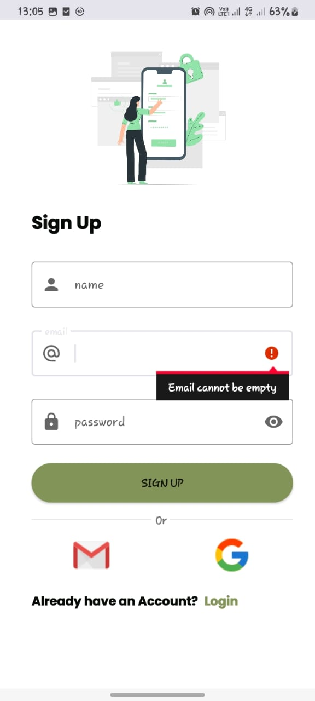
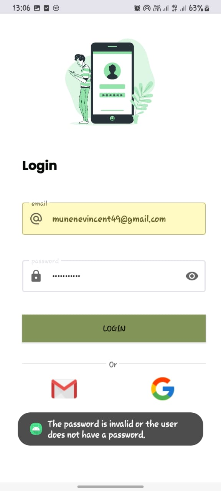
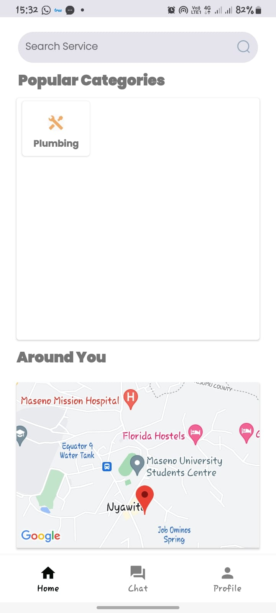
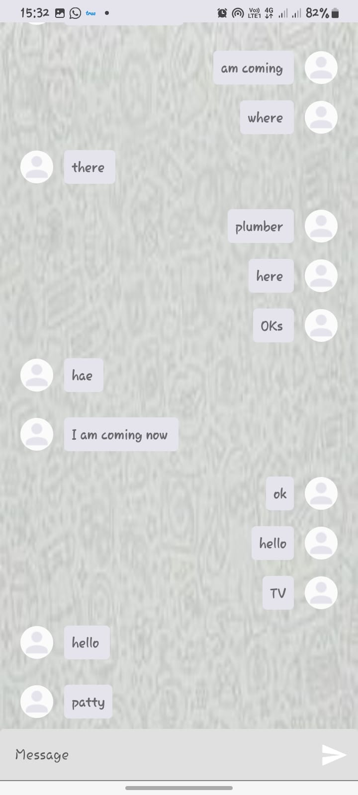
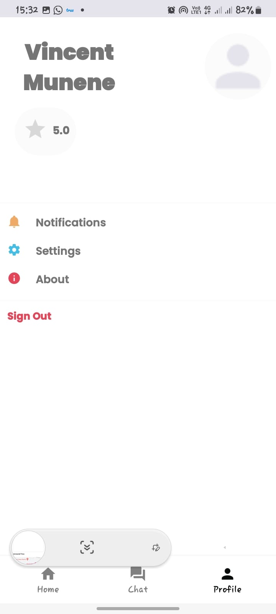
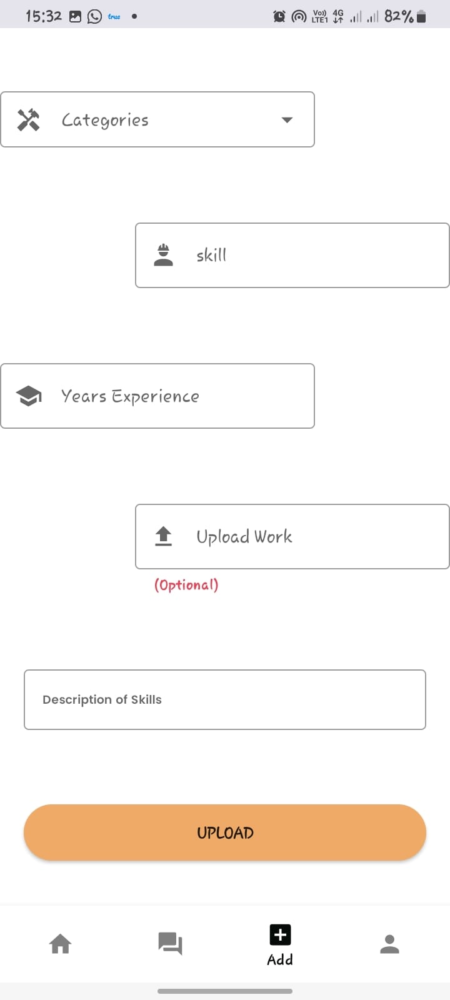

# README!!
This app is still in progress, it will become better
# Handy Jobs User Application and Professional Application
The user application allows a user to search for technical professionals near them, say 5Km around and allows them to contact these professionals.
The professional application allows for professionals to upload their skills and optional pictures of the work they do. Users can rate the professionals
and leave reviews after they complete their work to allow other users to know the qualities they are ordering. Professiionals too can rate their customers to curb rudeness by customers.

### Stack
- XML for the UI
- Jetpack libraries
    - Navigation
    - Flows
    - Coroutines
    
- Retrofit for message consumption
- Dagger hilt
- Glide for images
- Google maps API

### Architecture
I used MVVM architecture because of its ability to seperate concerns in an efficient way. 
I used firebase for the backend to store users data and authentication.

### Using the Applications
upon installation, both apps provide similar screens for registration or Login. On successful login however the layout of the apps differ, where the user is presented with a screen that enables them to search for professionals and provides a way to contact them. Location permissions are required to enable the app find professionals near you.
Professionals on the other hand are provided with a screen that enable them to upload their skills. Location permissions are also required. The apps also share an almost similar profile layout. 

### Screens
     

